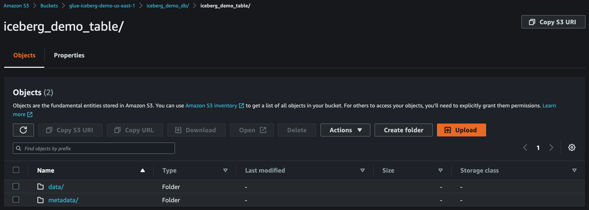
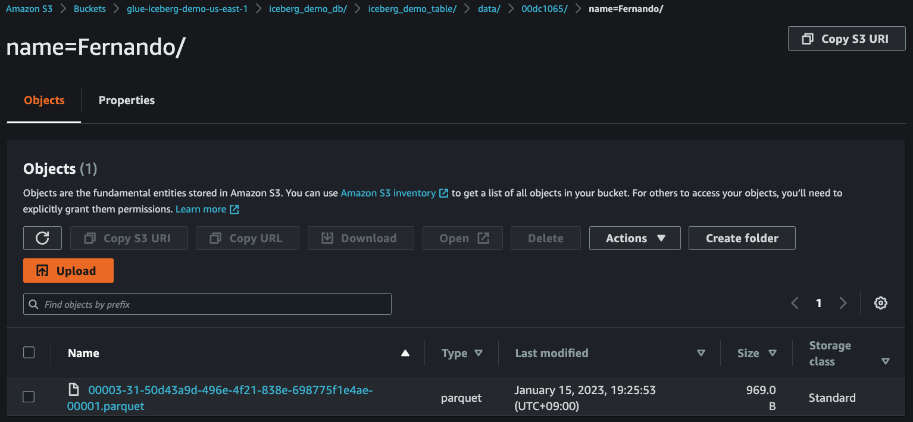

# AWS Glue Streaming ETL Job with Amazon MSK Serverless and Apace Iceberg


In this project, we create a streaming ETL job in AWS Glue to integrate Iceberg with a streaming use case and create an in-place updatable data lake on Amazon S3.

After streaming data are ingested from Amazon MSK Serverles to Amazon S3, you can query the data with [Amazon Athena](http://aws.amazon.com/athena).

This project can be deployed with [AWS CDK Python](https://docs.aws.amazon.com/cdk/api/v2/).
The `cdk.json` file tells the CDK Toolkit how to execute your app.

This project is set up like a standard Python project.  The initialization
process also creates a virtualenv within this project, stored under the `.venv`
directory.  To create the virtualenv it assumes that there is a `python3`
(or `python` for Windows) executable in your path with access to the `venv`
package. If for any reason the automatic creation of the virtualenv fails,
you can create the virtualenv manually.

To manually create a virtualenv on MacOS and Linux:

```
$ python3 -m venv .venv
```

After the init process completes and the virtualenv is created, you can use the following
step to activate your virtualenv.

```
$ source .venv/bin/activate
```

If you are a Windows platform, you would activate the virtualenv like this:

```
% .venv\Scripts\activate.bat
```

Once the virtualenv is activated, you can install the required dependencies.

```
(.venv) $ pip install -r requirements.txt
```

In case of `AWS Glue 3.0`, before synthesizing the CloudFormation, **you first set up Apache Iceberg connector for AWS Glue to use Apache Iceber with AWS Glue jobs.** (For more information, see [References](#references) (2))

Then you should set approperly the cdk context configuration file, `cdk.context.json`.

For example:
<pre>
{
  "vpc_name": "default",
  "msk_cluster_name": "iceberg-demo-stream",
  "glue_assets_s3_bucket_name": "aws-glue-assets-123456789012-atq4q5u",
  "glue_job_script_file_name": "spark_sql_merge_into_iceberg_from_msk_serverless.py",
  "glue_job_name": "streaming_data_from_msk_serverless_into_iceberg_table",
  "glue_job_input_arguments": {
    "--catalog": "job_catalog",
    "--database_name": "iceberg_demo_db",
    "--table_name": "iceberg_demo_table",
    "--primary_key": "name",
    "--kafka_topic_name": "ev_stream_data",
    "--starting_offsets_of_kafka_topic": "latest",
    "--iceberg_s3_path": "s3://glue-iceberg-demo-atq4q5u/iceberg_demo_db",
    "--lock_table_name": "iceberg_lock",
    "--aws_region": "us-east-1",
    "--window_size": "100 seconds",
    "--extra-jars": "s3://aws-glue-assets-123456789012-atq4q5u/extra-jars/aws-sdk-java-2.17.224.jar",
    "--user-jars-first": "true"
  },
  "glue_connections_name": "iceberg-connection"
}
</pre>

:information_source: `--primary_key` option should be set by Iceberg table's primary column name.

:warning: **You should create a S3 bucket for a glue job script and upload the glue job script file into the s3 bucket.**
At this point you can now synthesize the CloudFormation template for this code.

<pre>
(.venv) $ export CDK_DEFAULT_ACCOUNT=$(aws sts get-caller-identity --query Account --output text)
(.venv) $ export CDK_DEFAULT_REGION=$(curl -s 169.254.169.254/latest/dynamic/instance-identity/document | jq -r .region)
(.venv) $ cdk synth --all
</pre>

To add additional dependencies, for example other CDK libraries, just add
them to your `setup.py` file and rerun the `pip install -r requirements.txt`
command.

## Run Test

1. Set up **Apache Iceberg connector for AWS Glue** to use Apache Iceberg with AWS Glue jobs.
2. Create a MSK
   <pre>
   (.venv) $ cdk deploy MSKServerlessToIcebergStackVpc MSKServerlessAsGlueStreamingJobDataSource
   </pre>
3. Create a MSK connector for Glue Streaming Job
   <pre>
   (.venv) $ cdk deploy GlueMSKServerlessConnection
   </pre>
   For more information, see [References](#references) (8)
4. Create a IAM Role for Glue Streaming Job
   <pre>
   (.venv) $ cdk deploy GlueStreamingMSKServerlessToIcebergJobRole
   </pre>
5. Set up a Kafka Client Machine
   <pre>
   (.venv) $ cdk deploy MSKServerlessClientEC2Instance
   </pre>
6. Upload **AWS SDK for Java 2.x** jar file into S3
   <pre>
   (.venv) $ wget https://repo1.maven.org/maven2/software/amazon/awssdk/aws-sdk-java/2.17.224/aws-sdk-java-2.17.224.jar
   (.venv) $ aws s3 cp aws-sdk-java-2.17.224.jar s3://aws-glue-assets-123456789012-atq4q5u/extra-jars/aws-sdk-java-2.17.224.jar
   </pre>
   A Glue Streaming Job might fail because of the following error:
   <pre>
   py4j.protocol.Py4JJavaError: An error occurred while calling o135.start.
   : java.lang.NoSuchMethodError: software.amazon.awssdk.utils.SystemSetting.getStringValueFromEnvironmentVariable(Ljava/lang/String;)Ljava/util/Optional
   </pre>
   We can work around the problem by starting the Glue Job with the additional parameters:
   <pre>
   --extra-jars <i>s3://path/to/aws-sdk-for-java-v2.jar</i>
   --user-jars-first true
   </pre>
   In order to do this, we might need to upload **AWS SDK for Java 2.x** jar file into S3.
7. Create a Glue Streaming Job

   * (step 1) Select one of Glue Job Scripts and upload into S3

     **List of Glue Job Scirpts**
     | File name | Spark Writes |
     |-----------|--------------|
     | spark_dataframe_insert_iceberg_from_msk_serverless.py | DataFrame append |
     | spark_sql_insert_overwrite_iceberg_from_msk_serverless.py | SQL insert overwrite |
     | spark_sql_merge_into_iceberg_from_msk_serverless.py | SQL merge into |

     <pre>
     (.venv) $ ls src/main/python/
      spark_dataframe_insert_iceberg_from_msk_serverless.py
      spark_sql_insert_overwrite_iceberg_from_msk_serverless.py
      spark_sql_merge_into_iceberg_from_msk_serverless.py
     (.venv) $ aws s3 mb <i>s3://aws-glue-assets-123456789012-atq4q5u</i> --region <i>us-east-1</i>
     (.venv) $ aws s3 cp src/main/python/spark_sql_merge_into_iceberg_from_msk_serverless.py <i>s3://aws-glue-assets-123456789012-atq4q5u/scripts/</i>
     </pre>

   * (step 2) Provision the Glue Streaming Job

     </pre>
     (.venv) $ cdk deploy GlueStreamingJobMSKServerlessToIceberg
     </pre>

8. Create a table with partitioned data in Amazon Athena

   Go to [Athena](https://console.aws.amazon.com/athena/home) on the AWS Management console.<br/>
   * (step 1) Create a database

     In order to create a new database called `iceberg_demo_db`, enter the following statement in the Athena query editor
     and click the **Run** button to execute the query.

     <pre>
     CREATE DATABASE IF NOT EXISTS iceberg_demo_db
     </pre>

    * (step 2) Create a table

      Copy the following query into the Athena query editor, replace the `xxxxxxx` in the last line under `LOCATION` with the string of your S3 bucket, and execute the query to create a new table.
      <pre>
      CREATE TABLE iceberg_demo_db.iceberg_demo_table (
        name string,
        age int,
        m_time timestamp
      )
      PARTITIONED BY (`name`)
      LOCATION 's3://glue-iceberg-demo-atq4q5u/iceberg_demo_db/iceberg_demo_table'
      TBLPROPERTIES (
        'table_type'='iceberg'
      );
      </pre>
      If the query is successful, a table named `iceberg_demo_table` is created and displayed on the left panel under the **Tables** section.

      If you get an error, check if (a) you have updated the `LOCATION` to the correct S3 bucket name, (b) you have mydatabase selected under the Database dropdown, and (c) you have `AwsDataCatalog` selected as the **Data source**.

      :information_source: If you fail to create the table, give Athena users access permissions on `iceberg_demo_db` through [AWS Lake Formation](https://console.aws.amazon.com/lakeformation/home), or you can grant anyone using Athena to access `iceberg_demo_db` by running the following command:
      <pre>
      (.venv) $ aws lakeformation grant-permissions \
              --principal DataLakePrincipalIdentifier=arn:aws:iam::<i>{account-id}</i>:user/<i>example-user-id</i> \
              --permissions SELECT DESCRIBE ALTER INSERT DELETE DROP \
              --resource '{ "Table": {"DatabaseName": "iceberg_demo_db", "TableWildcard": {}} }'
      </pre>

9. Make sure the glue job to access the Iceberg table in the Glue Catalog database

   Wec can get permissions by running the following command:
   <pre>
   (.venv) $ aws lakeformation list-permissions | jq -r '.PrincipalResourcePermissions[] | select(.Principal.DataLakePrincipalIdentifier | endswith(":role/GlueJobRole-MSKServerless2Iceberg"))'
   </pre>
   Also, we can grant the glue job to required permissions by running the following command:
   <pre>
   (.venv) $ aws lakeformation grant-permissions \
               --principal DataLakePrincipalIdentifier=arn:aws:iam::<i>{account-id}</i>:role/<i>GlueJobRole-MSKServerless2Iceberg</i> \
               --permissions SELECT DESCRIBE ALTER INSERT DELETE \
               --resource '{ "Table": {"DatabaseName": "<i>iceberg_demo_db</i>", "TableWildcard": {}} }'
   </pre>

10. Run glue job to load data from MSK into S3
    <pre>
    (.venv) $ aws glue start-job-run --job-name <i>streaming_data_from_msk_serverless_into_iceberg_table</i>
    </pre>

11. Generate streaming data

    1. Connect the MSK client EC2 Host.

       You can connect to an EC2 instance using the EC2 Instance Connect CLI.<br/>
       Install `ec2instanceconnectcli` python package and Use the **mssh** command with the instance ID as follows.
       <pre>
       $ sudo pip install ec2instanceconnectcli
       $ mssh ec2-user@<i>i-001234a4bf70dec41EXAMPLE</i>
       </pre>

    2. Create an Apache Kafka topic
       After connect your EC2 Host, you use the client machine to create a topic on the cluster.
       Run the following command to create a topic called `ev_stream_data`.
       <pre>
       [ec2-user@ip-172-31-0-180 ~]$ export PATH=$HOME/opt/kafka/bin:$PATH
       [ec2-user@ip-172-31-0-180 ~]$ export BS=<i>{BootstrapBrokerString}</i>
       [ec2-user@ip-172-31-0-180 ~]$ kafka-topics.sh --bootstrap-server $BS \
          --command-config client.properties \
          --create \
          --topic <i>ev_stream_data</i> \
          --partitions 3 \
          --replication-factor 2
       </pre>

    3. Produce and consume data

       **(1) To produce messages**

       Run the following command to generate messages into the topic on the cluster.

       <pre>
       [ec2-user@ip-172-31-0-180 ~]$ python3 gen_fake_data.py | kafka-console-producer.sh \
          --bootstrap-server $BS \
          --producer.config client.properties \
          --topic <i>ev_stream_data</i> \
          --property parse.key=true \
          --property key.seperator='\t'
       </pre>

       **(2) To consume messages**

       Keep the connection to the client machine open, and then open a second, separate connection to that machine in a new window.

       <pre>
       [ec2-user@ip-172-31-0-180 ~]$ kafka-console-consumer.sh --bootstrap-server $BS \
          --consumer.config client.properties \
          --topic <i>ev_stream_data</i> \
          --from-beginning
       </pre>

       You start seeing the messages you entered earlier when you used the console producer command.
       Enter more messages in the producer window, and watch them appear in the consumer window.

    We can synthetically generate data in JSON format using a simple Python application.

    Synthentic Data Example order by `name` and `m_time`
    <pre>
    {"name": "Arica", "age": 48, "m_time": "2023-04-11 19:13:21"}
    {"name": "Arica", "age": 32, "m_time": "2023-10-20 17:24:17"}
    {"name": "Arica", "age": 45, "m_time": "2023-12-26 01:20:49"}
    {"name": "Fernando", "age": 16, "m_time": "2023-05-22 00:13:55"}
    {"name": "Gonzalo", "age": 37, "m_time": "2023-01-11 06:18:26"}
    {"name": "Gonzalo", "age": 60, "m_time": "2023-01-25 16:54:26"}
    {"name": "Micheal", "age": 45, "m_time": "2023-04-07 06:18:17"}
    {"name": "Micheal", "age": 44, "m_time": "2023-12-14 09:02:57"}
    {"name": "Takisha", "age": 48, "m_time": "2023-12-20 16:44:13"}
    {"name": "Takisha", "age": 24, "m_time": "2023-12-30 12:38:23"}
    </pre>

    Spark Writes using `DataFrame append` insert all records into the Iceberg table.
    <pre>
    {"name": "Arica", "age": 48, "m_time": "2023-04-11 19:13:21"}
    {"name": "Arica", "age": 32, "m_time": "2023-10-20 17:24:17"}
    {"name": "Arica", "age": 45, "m_time": "2023-12-26 01:20:49"}
    {"name": "Fernando", "age": 16, "m_time": "2023-05-22 00:13:55"}
    {"name": "Gonzalo", "age": 37, "m_time": "2023-01-11 06:18:26"}
    {"name": "Gonzalo", "age": 60, "m_time": "2023-01-25 16:54:26"}
    {"name": "Micheal", "age": 45, "m_time": "2023-04-07 06:18:17"}
    {"name": "Micheal", "age": 44, "m_time": "2023-12-14 09:02:57"}
    {"name": "Takisha", "age": 48, "m_time": "2023-12-20 16:44:13"}
    {"name": "Takisha", "age": 24, "m_time": "2023-12-30 12:38:23"}
    </pre>

    Spark Writes using `SQL insert overwrite` or `SQL merge into` insert the last updated records into the Iceberg table.
    <pre>
    {"name": "Arica", "age": 45, "m_time": "2023-12-26 01:20:49"}
    {"name": "Fernando", "age": 16, "m_time": "2023-05-22 00:13:55"}
    {"name": "Gonzalo", "age": 60, "m_time": "2023-01-25 16:54:26"}
    {"name": "Micheal", "age": 44, "m_time": "2023-12-14 09:02:57"}
    {"name": "Takisha", "age": 24, "m_time": "2023-12-30 12:38:23"}
    </pre>

12. Check streaming data in S3

    After 3~5 minutes, you can see that the streaming data have been delivered from **MSK** to **S3** and stored in a folder structure by year, month, day, and hour.

    
    
    
    

13. Run test query

    Enter the following SQL statement and execute the query.
    <pre>
    SELECT COUNT(*)
    FROM iceberg_demo_db.iceberg_demo_table;
    </pre>

## Clean Up
1. Stop the glue streaming job.
   <pre>
   (.venv) $ JOB_RUN_IDS=$(aws glue get-job-runs --job-name <i>streaming_data_from_msk_serverless_into_iceberg_table</i> | jq -r '.JobRuns[] | select(.JobRunState == "RUNNING") | .Id')
   (.venv) $ aws glue batch-stop-job-run --job-name <i>streaming_data_from_msk_serverless_into_iceberg_table</i> --job-run-ids $JOB_RUN_IDS
   </pre>
2. Delete the CloudFormation stack by running the below command.
   <pre>
   (.venv) $ cdk destroy --all
   </pre>

## Useful commands

 * `cdk ls`          list all stacks in the app
 * `cdk synth`       emits the synthesized CloudFormation template
 * `cdk deploy`      deploy this stack to your default AWS account/region
 * `cdk diff`        compare deployed stack with current state
 * `cdk docs`        open CDK documentation

## References

 * (1) [AWS Glue versions](https://docs.aws.amazon.com/glue/latest/dg/release-notes.html): The AWS Glue version determines the versions of Apache Spark and Python that AWS Glue supports.
 * (2) [Use the AWS Glue connector to read and write Apache Iceberg tables with ACID transactions and perform time travel \(2022-06-21\)](https://aws.amazon.com/ko/blogs/big-data/use-the-aws-glue-connector-to-read-and-write-apache-iceberg-tables-with-acid-transactions-and-perform-time-travel/)
 * (3) [Spark Stream Processing with Amazon EMR using Apache Kafka streams running in Amazon MSK (2022-06-30)](https://yogender027mae.medium.com/spark-stream-processing-with-amazon-emr-using-apache-kafka-streams-running-in-amazon-msk-9776036c18d9)
   * [yogenderPalChandra/AmazonMSK-EMR-tem-data](https://github.com/yogenderPalChandra/AmazonMSK-EMR-tem-data) - This is repo for medium article "Spark Stream Processing with Amazon EMR using Kafka streams running in Amazon MSK"
 * (4) [Amazon Athena Using Iceberg tables](https://docs.aws.amazon.com/athena/latest/ug/querying-iceberg.html)
 * (5) [Streaming ETL jobs in AWS Glue](https://docs.aws.amazon.com/glue/latest/dg/add-job-streaming.html)
 * (6) [AWS Glue job parameters](https://docs.aws.amazon.com/glue/latest/dg/aws-glue-programming-etl-glue-arguments.html)
 * (7) [Connection types and options for ETL in AWS Glue](https://docs.aws.amazon.com/glue/latest/dg/aws-glue-programming-etl-connect.html#aws-glue-programming-etl-connect-kafka)
 * (8) [Creating an AWS Glue connection for an Apache Kafka data stream](https://docs.aws.amazon.com/glue/latest/dg/add-job-streaming.html#create-conn-streaming)
 * (9) [Crafting serverless streaming ETL jobs with AWS Glue (2020-10-14)](https://aws.amazon.com/ko/blogs/big-data/crafting-serverless-streaming-etl-jobs-with-aws-glue/)
 * (10) [Actions, resources, and condition keys for Apache Kafka APIs for Amazon MSK clusters](https://docs.aws.amazon.com/service-authorization/latest/reference/list_apachekafkaapisforamazonmskclusters.html)
 * (11) [Apache Iceberg - Spark Writes with SQL (v0.14.0)](https://iceberg.apache.org/docs/0.14.0/spark-writes/)
 * (12) [Apache Iceberg - Spark Structured Streaming (v0.14.0)](https://iceberg.apache.org/docs/0.14.0/spark-structured-streaming/)
 * (13) [Apache Iceberg - Writing against partitioned table (v0.14.0)](https://iceberg.apache.org/docs/0.14.0/spark-structured-streaming/#writing-against-partitioned-table)
   * Iceberg supports append and complete output modes:
     * `append`: appends the rows of every micro-batch to the table
     * `complete`: replaces the table contents every micro-batch

       Iceberg requires the data to be sorted according to the partition spec per task (Spark partition) in prior to write against partitioned table.<br/>
       Otherwise, you might encounter the following error:
       <pre>
       pyspark.sql.utils.AnalysisException: Complete output mode not supported when there are no streaming aggregations on streaming DataFrame/Datasets;
       </pre>
 * (14) [Apache Iceberg - Maintenance for streaming tables (v0.14.0)](https://iceberg.apache.org/docs/0.14.0/spark-structured-streaming/#maintenance-for-streaming-tables)
 * (15) [awsglue python package](https://github.com/awslabs/aws-glue-libs): The awsglue Python package contains the Python portion of the AWS Glue library. This library extends PySpark to support serverless ETL on AWS.

Enjoy!
